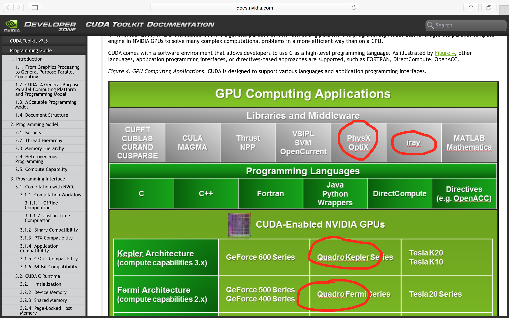

# Parallel Computing using Swift and Metal

>  It was written on 2016-02-08, and posted on my jekyll site. Since I have retired my jekyll site, better to keep a copy here. 


In 4 weeks of part-time effort, with zero knowledge in Swift/Metal but the help of the Internet and curiosity, I evolved a [sample code](http://memkite.com/blog/2014/12/15/data-parallel-programming-with-metal-and-swift-for-iphoneipad-gpu) found on the Internet into a full feature and easy-to-use and -modify code for one of my research problems requiring large scale parallel computing. Please feel free to check out the Swift/Metal code from [my github repository](https://github.com/reijz/ParallelComputing-Swift-Metal) and let me know any feedback you may have.

## How did it get started

Recently my colleagues and I have been working on *approximate dynamic programming* with applications in perishable inventory management. At some point, we needed to perform numerical experiments to demonstrate the nice theories and approximation algorithms we created to solve the problem (at least approximately). 

The computing task in a nut shell, putting aside the mathematics, is to initialize a large array of size $K^L$ (e.g., $K=9$, $L=8$) and then iterate the array according to some rule for a few (say $T$) times. **The initialization and each iteration can be done in parallel**. 

Nvidia has made a lot of buzz in the field of parallel computing (or Artificial Intelligence, Deep Learning, Neural-Network, or whatever buzz word they call it) by utilizing large number (about 2000) of computing cores in their video cards. Though I haven't coded using C/C++ for several years, I know the existence of parallel computing platforms such as CUDA and OpenCL, with the former making much louder sound. 

In the spring of 2015, I hired two smart kids major in CS and ECE on our campus to write a computer program for our mathematical model using CUDA. After several months of communication involving my PhD student (who knows deep in the math but not much on coding), the two programmers and myself, we got a working code in CUDA which runs blazing fast if you imagine how long such computing task would take with a traditional single thread CPU computing.


## An adventure

However, the CUDA code was not written in a clean way making further changes quite difficult. As the research on theories develops, we need modification on the algorithms from time to time, but programmers will never be so freely available. More importantly, I got curious about the parallel computing, and wanted to know what's going on there. I managed to hire one of the programmers to continue work for me in the summer of 2015, as the other got an intern job at Tensent, a tech giant in China. We aimed to create a clean version of code using OpenCL as I have a top configured MacPro (2013, a.k.a. "trash can"), which does not support CUDA. We failed that task. One reason is that OpenCL is indeed a lot harder to use than CUDA, although it can harness both CPU and GPU power. This is how [Metal](https://developer.apple.com/metal/), an OpenGL/CL replacement on Mac OS and much more beyond in my view, comes into play. The project turns out to be a nice adventure. 

> Things are NOT as difficult as they appear to be!

We are probably living in the best age in the human history, despite pollution, inequality, poverty, etc., which anyway exist all time. The Internet and curiosity can teach you pretty much everything and enable you to get things done. The following are the main steps I took in this effort. 

1. Naturally, I started by reading Apple's [Metal Programming Guide](https://developer.apple.com/library/ios/documentation/Miscellaneous/Conceptual/MetalProgrammingGuide/Introduction/Introduction.html), which was not a terribly long document, but fun and easy to read. Essentially, one just needs to focus on the chapter "Data-Parallel Compute Processing: Compute Command Encoder", which clearly instructed a standard procedure to do parallel computing. The document did not provide any sample code, and I happen to start with absolutely zero knowledge in Swift. So I found a swift [programming course](https://www.coursera.org/learn/swift-programming) on Coursera and went through the first three weeks' content. I also skimmed through the [The Swift Programming Language](https://swift.org/documentation/TheSwiftProgrammingLanguage(Swift2.2).epub) book published by Apple.

2. At the turn of 2015 to 2016, only a handful of related results can be found by Googling keywords like "parallel computing swift metal". The article written by [Amund Tveit](https://www.linkedin.com/in/amundtveit) a year ago, [Data-Parallel Programming with Metal and Swift for iPhone/iPad GPU](http://memkite.com/blog/2014/12/15/data-parallel-programming-with-metal-and-swift-for-iphoneipad-gpu), is particularly helpful. With the help of the official [Metal Programming Guide](https://developer.apple.com/library/ios/documentation/Miscellaneous/Conceptual/MetalProgrammingGuide/Introduction/Introduction.html) and some googling, I managed to compile and run Amund's sample code with some [minor tweaks](### Swift is a developing language).

   The code basically utilizes Swift/Metal to compute the Sigmund function for a large number of input values in parallel. However, this is far from what I need, since my algorithm requires full control of assigning computing cores to individual elements in the array and more. 

3. I found a nice [CUDA course](https://www.coursera.org/course/hetero) on Coursera and studied the first five weeks' content since Apple's [Metal Programming Guide](https://developer.apple.com/library/ios/documentation/Miscellaneous/Conceptual/MetalProgrammingGuide/Introduction/Introduction.html) stated the prerequisites "You should be familiar with the Objective-C language and experienced in programming with OpenGL, OpenCL, or similar APIs." 
Despite all the grammar and formality, the key thing I learned from this course is "linearity", or how to assign computing tasks to cores. This is exactly what I needed to know. 
With this knowledge, I studied carefully the CUDA code written by my programmers. 

4. Metal seems to take quite a different approach than CUDA. For example, CUDA has three function type qualifiers, `__divice__`, `__global__` and `__host__`, which determines where the function can be called and executed. This enables quite some freedom in terms of structuring the code and designing the algorithm. I am sure the real "Kongfu" masters can write beautiful code with such freedom. But for less talented general public, this seems overly complicated and may make code hard to read/debug/modify. Briefly, `__Global__` functions can be called from the host side using CUDA kernel call semantics `<<<grid_dim, block_dim>>>`, while `__device__` functions can only be called from other device or global functions. The `grid_dim` and `block_dim` help to specific which cores compute which data. 

   The Metal framework seems to build a "wall" between the device and host. Those functions on device are written in Objective C (with some limitations such as dynamic memory allocation is forbidden) while functions on host are written in Swift [^objectivec]. You don't **call** a device function, you only **schedule** the device function.  
   For the device functions, there are some built-in input arguments, such as 
   
   | Attribute Qualifier |
   | ------------- |
   | `[[ thread_position_in_grid ]]` |
   | `[[ thread_position_in_threadgroup ]]` |
   | `[[ thread_index_in_threadgroup ]]` |
   | `[[ threadgroup_position_in_grid ]]` |
   | `[[ threads_per_grid ]]` |
   | `[[ threads_per_threadgroup ]]` |
   | `[[ threadgroups_per_grid ]]` |
   | `[[ thread_execution_width ]]` |
   
   In other words, you never need to explicitly transmit the information about grid dimension and block dimension. I wrote the following code in order to test my understanding. 
   
   Another disadvantage of such a "wall" is to make transmission of parameters inconvenient. And you certainly do not want to specify a set of parameters twice in both the Objective C for device and Swift for host. A workaround is to use shared buffer to transmit parameters. See my [code](https://github.com/reijz/ParallelComputing-Swift-Metal) for example. 

   [^objectivec]: For those who prefer to use Objective C over Swift, they can still write function on host using Objective C. But the wall still exists. 
   

```swift
// to test the understanding of thread related concepts
kernel void testThread(device float *result [[ buffer(0) ]],
                    uint id [[ thread_position_in_grid ]],
                    uint i [[ thread_position_in_threadgroup ]],
                    uint w [[ threadgroup_position_in_grid ]],
                    uint S [[ threads_per_threadgroup ]]) {

if (id == w*S+i)
    result[id] = id;
else
    result[id] = 0;
}
```


## Beyond this project

Well, I got a nice code for my research project. And my PhD student is using it to do extensive numerical experiments on my Mac Pro. On the way, I picked up a new programming language and learned a lot more. I also involved my PhD student in this adventure. Now he seems feel more comfortable with coding. 

More importantly, this adventure triggers some thoughts on various related issues. I would like to share one, that is **knowing more enables you to see things clearly**. 

Coming back to Nvidia, "the" major player in parallel computing, they seem to have a line of both hardware and software products. Tesla K40 GPU seems to be a popular choice for high performance computing. As of January 2016, I got the following estimated price quote


| |GPU Compute Node|Top configured MacPro|
| ------------- | ------------- | ------------- |
| Price | 11,000 USD | 9,000 USD |
| CPU | 2 x Intel Xeon E5-2670 | 1 x Intel Xeon E5-2697 |
| Memory | 64G | 64G |
| GPU | 2 x Nvidia Tesla K40  | 2 x AMD FirePro D700 |
| Hard disk | 1.2 TB 10K rpm | 1 TB SSD |
| Something I don't know | 2 x GE network interfaces |  |
| Something I don't know | 1 x 56Gb Infiniband adapter |  |

**The notoriously expensive Apple product is cheaper by 20%.** Ok, the MacPro only has one Intel Xeon E5 (12-core) processor instead of two, but it has 1TB flash drive instead of traditional spinning hard disk. Anyway, it's fair to say these two configurations are comparable.

I know you may want to talk about the **performance**. Since I have both CUDA and Swift/Metal codes, I did the comparison based on computing task for my research problem. For exactly the same set of [parameters]({{ site.url }}{{ site.asset }}/CUDA/parameters.plist), the following table shows the computing time (in seconds) on our university's Tesla K40 server and my MacPro, both using only a single GPU and float precision (instead of double precision).

| `threadExecutionWidth` | Nvidia Tesla M2090| Nvidia Tesla K20 | Nvidia Tesla K40 | AMD FirePro D700 on MacPro | NVIDIA GeForce GT 650M on MacBook Pro (2012)|
| ------------- | ------------- | ------------- | ------------- | ------------- | ------------- |
| 1 | 446 | 2451 | | 728 | NA |
| 2 | 259 | 1406 | | 403 | NA |
| 4 | 166 | 867 | | 217 | NA |
| 8 | 124 | 307 | | 123 | NA |
| 16 | 105 | 332 | | 87 | 245 |
| 32 | **99** | 212 | | 99 | 131 |
| 64 | 109 | 215 | | 106 | 88 |
| 128 | 108 | **214** | | 106 | **79** |
| 256 | 110 | **214** | | 107 | 81 |
| 512 | 111 | **214** | | 108 | 84 |
| 1024 | NA[^thread] | 215 |  | 104 | 99 |
| 2048 | NA | NA | | **87.36** | NA |

The `threadExecutionWidth` is set in CUDA 

```c++
*block_dim = dim3(width:threadExecutionWidth, 1, 1);
```

and is set in Swift/Metal

```swift
let numThreadsPerGroup = MTLSize(width:threadExecutionWidth,height:1,depth:1)
```

As of writing this article, I still do not understand how would the `threadExecutionWidth` affect the speed. In theory, it should not. But the little experiment I did in the above table show the other way. And it is not even monotone, larger `threadExecutionWidth` faster speed, as generally perceived. 

[^thread]: My programmer told me that `threadExecutionWidth` cannot be higher than 512 on Tesla M2090. [http://stackoverflow.com/questions/5062781/cuda-max-threads-in-a-block](http://stackoverflow.com/questions/5062781/cuda-max-threads-in-a-block) And Indeed, setting an NA `threadExecutionWidth`, the CUDA and swift code will compile and run, but yield completely wrong results. 


Yes, my **MacPro is about 10% faster than Tesla M2090 GPU server, and much fast than K20.** In addition to performing the parallel computing task, my MacPro serves as github and VPN server for my whole research team. My team also run traditional single thread Python and Java code on this machine quite frequently. Moreover, I use it as a day-to-day computer, typing this article for example. Don't forget that I could do professional video/photo/sound editing and play stunning 3D game on this machine had I have that skill set. As a final remark, my MacPro, with only 44W when Idle and 270W at CPU Max[^power], is a lot more energy efficient than most servers on the market. 

However, it is surprising that the 2,500 USD MacBook Pro 15" purchased in 2012 is the fastest in this test! There are simply many things we, as general users of those parellel computing platform, don't know. 

[^power]: The MacPro power consumption can be found at [https://support.apple.com/en-us/HT201796](https://support.apple.com/en-us/HT201796)

I am not surprised that Nvidia loses to Apple on scientific parallel computing using GPU, which is not a focus of Apple. Here is a screenshot I took while browsing the official [CUDA Document](http://docs.nvidia.com/cuda/cuda-c-programming-guide/#axzz3zfjtApED). 



Did you notice the red line under those words like "Quadro" and "Mathematica"? The table is a picture, presumably prepared using something like Word which highlights any misspelling. What an irresponsible team would do such a lousy job! I have problem believing how well things can be designed and optimized underneath the hood of the CUDA system. It seems Nvidia focus too much on marketing, since I've heard so much about it while its document is so lousy. You may take a look at the Apple document, e.g., [Metal Shading Language Guide](https://developer.apple.com/library/ios/documentation/Metal/Reference/MetalShadingLanguageGuide/Introduction/Introduction.html), just for comparison. I don't mean that giving the document a face lift would make the product great. What I mean is that we need to focus on making truely great stuff in every aspect we could possibly think of. 